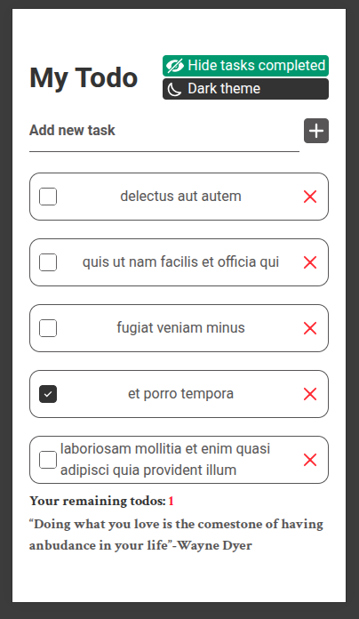

# My Todo

My Todo est une application responsive de tâche ou Todo comme les autres mais avec d'autres fonctionnalités comme le mode sombre du thème et le filtrage des tâches complétés.

# Tech : REACT.JS + TAILWIND CSS V4 avec VITE

# Capture de My Todo

ou [visiter le sur Vercel](https://my-todo-eight-zeta.vercel.app/)

# Architecture du projet

- src/assets : contient tous les fichiers svg du projet, c'est à dire les icônes.
- src/components : contient tous les composants réutilisables de l'application.
    * Data.jsx : représente une donnée de la requête `fetch()` ou **une saisie de l'utilisateur**.
    * Delete.jsx : est `le svg X` qui permet de supprimer un **Todo**.
- function/overall.js : composé de 2 fonctions dont le premier une fonction asynchrone qui retournera un `JSON()` à la fin et la deuxième est `dataCreated()` qui retournera **une donnée de format JSON()**.
- src/layout/BodyContainer.jsx: représente le contenu parental de **My Todo**.
- src/styles/reset.css : repreésente le style par défaut **des baliles HTML**.
- App.jsx : n'est juste que l'appelation du `BodyContainer.jsx` avec le mode du thème de **My Todo**.

# Obtenir le projet
1)   Cloner le projet.
2)  Installer le dépendance : 
    * cd MyTodo
    * npm install (pour installer les dépendaces)
